# YouTube MCP Server

Model Context Protocol (MCP) server providing structured tools for extracting, analyzing, and automating insights from YouTube channels and videos.

This project exposes YouTube intelligence capabilities as MCP-compatible tools so AI agents, automation pipelines, and analytics workflows can interact with YouTube data in a standardized way.

---

## Overview

This repository provides a modular MCP server that enables:

* Channel analytics
* Video metadata extraction
* Comments and transcript retrieval
* Thumbnail analysis
* SEO insights
* Trend tracking
* Engagement analytics
* Comment keyword intelligence

Designed primarily for AI agent orchestration, YouTube automation workflows, and content intelligence research.

---

## Tools Available (16 Total)

## Channel Analysis

### get_channel_overview

Retrieves channel statistics and metadata.

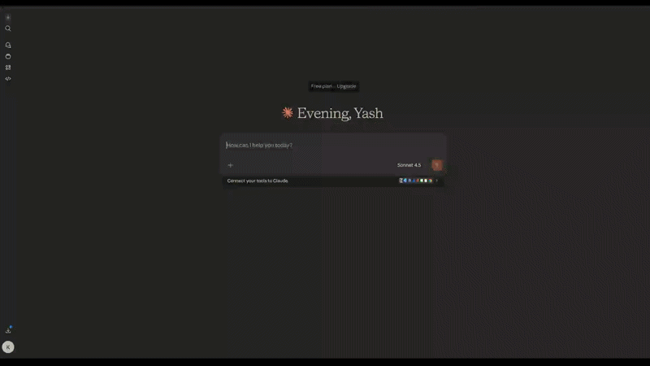

### get_channel_videos

Lists videos from a channel.

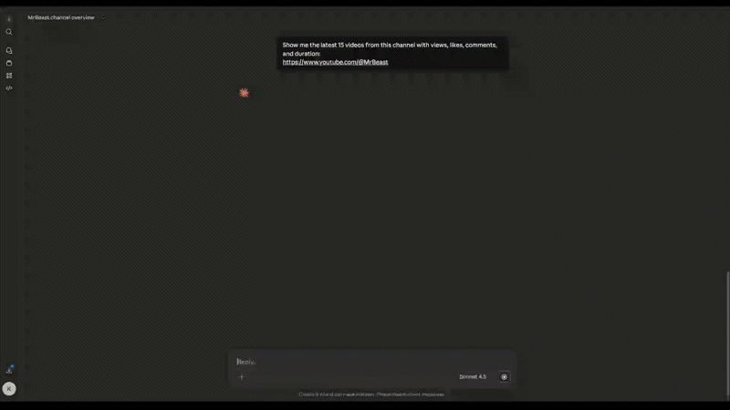

### get_channel_topics

Extracts dominant channel themes.

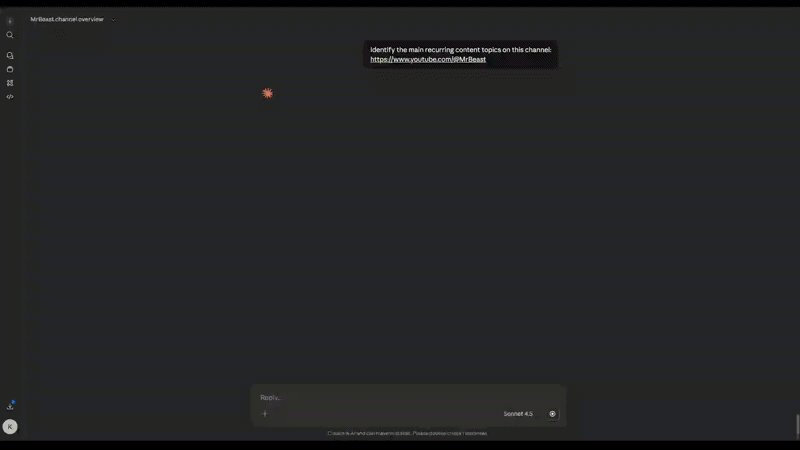

### compare_channels

Comparative analytics between channels.

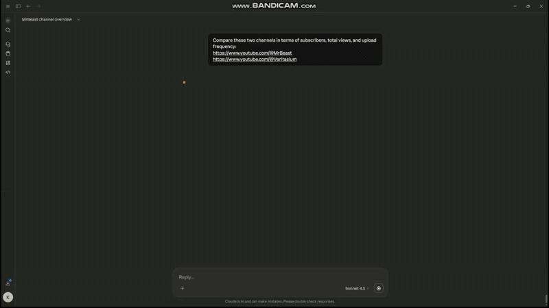

### get_upload_schedule

Identifies posting patterns.

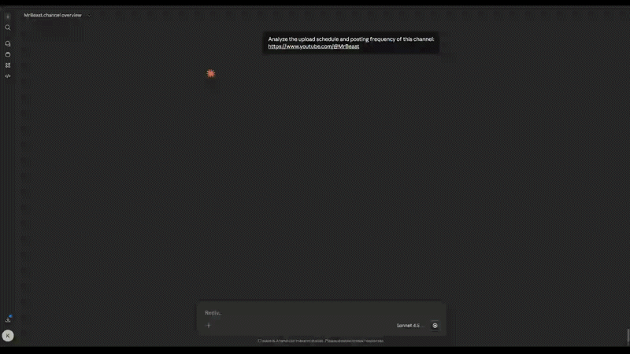

---

## Video Intelligence

### get_video_details

Metadata and engagement metrics extraction.

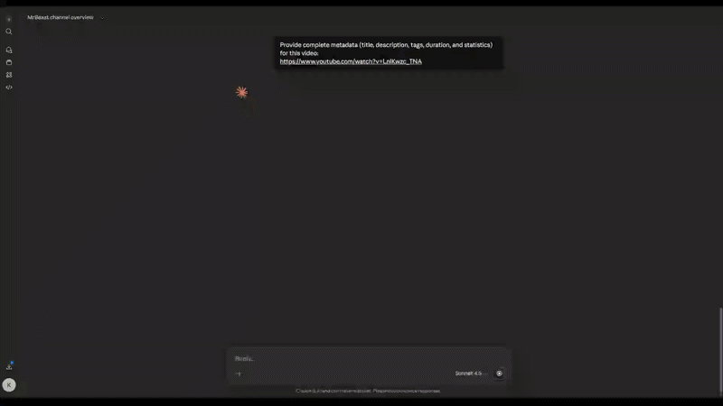

### get_video_comments

Comment extraction and analysis.

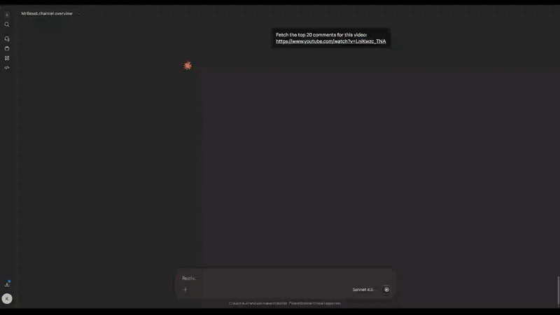

### get_video_transcript

Transcript retrieval for NLP workflows.


### compare_videos

Performance comparison across videos.

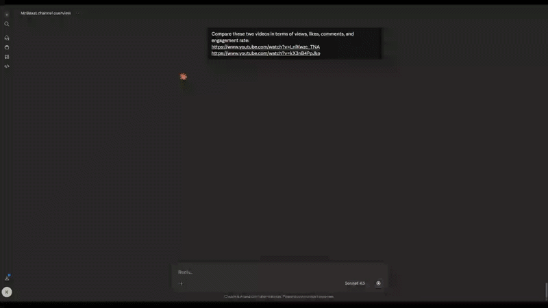

### get_top_videos

Best performing content detection.

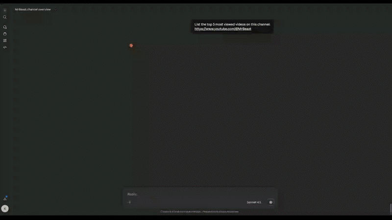

---

## Optimization, SEO & Trends

### analyze_thumbnail

Thumbnail effectiveness analysis.

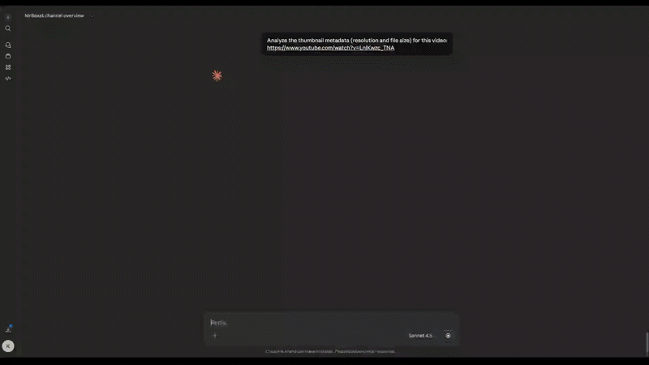

### get_video_seo_score

SEO evaluation for discoverability.

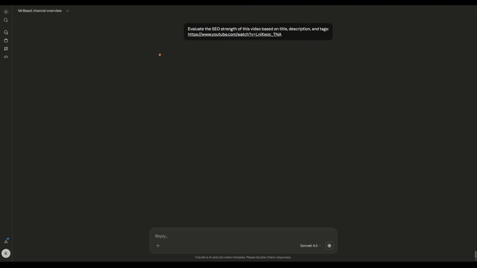

### get_tag_analysis

Tag optimization insights.

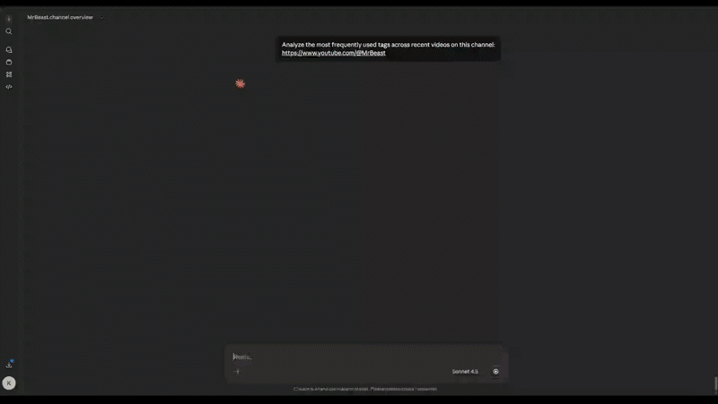

### get_trending_videos

Trending content discovery.

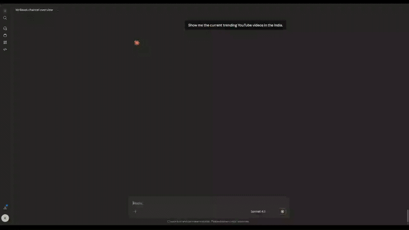

---

## Advanced Analytics

### get_engagement_stats

Deep engagement metrics across videos.

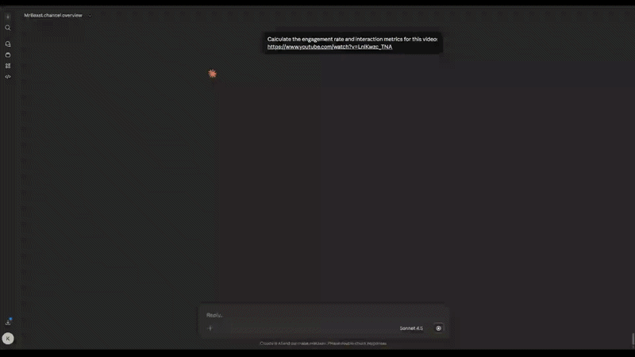

### get_comment_keywords

Extracts keyword intelligence from comments.

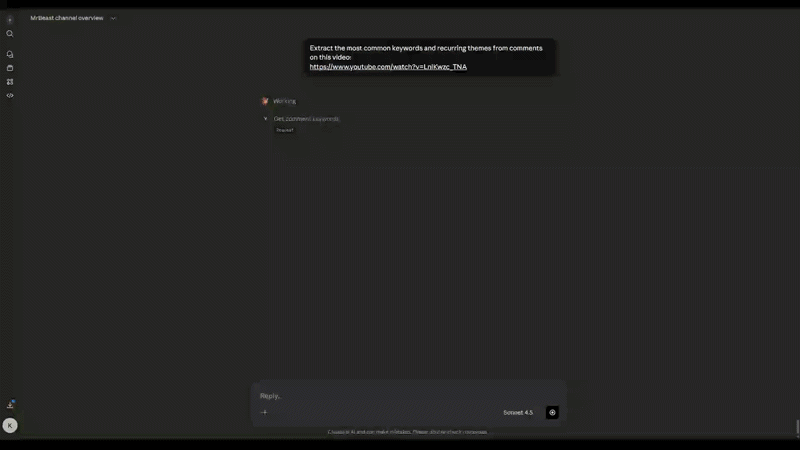

---

## Installation

```bash
git clone https://github.com/Yashkashte5/Youtube-MCP.git
cd Youtube-MCP
pip install -r requirements.txt
```

---

## Running the MCP Server

```bash
python server.py
```

If integrated with an MCP runtime/client:

```bash
mcp run server.py
```

---

## Example Use Cases

* AI YouTube automation agents
* Content strategy analysis
* Competitor benchmarking
* Automated SEO recommendations
* Audience sentiment analysis
* Engagement analytics dashboards

---

## Project Structure

```
Youtube-MCP/
│
├── server.py
├── tools/
├── Demos/
├── requirements.txt
└── README.md
```

---

## Roadmap

* Expanded analytics tools
* Cross-platform video intelligence
* Stronger MCP agent orchestration integrations
* Real-time trend monitoring

---

## Contribution

Pull requests and improvements are welcome. Focus areas:

* Tool reliability
* Performance optimization
* Additional analytics capabilities

---

## Author

**Yash Kashte**
GitHub: [https://github.com/Yashkashte5](https://github.com/Yashkashte5)
